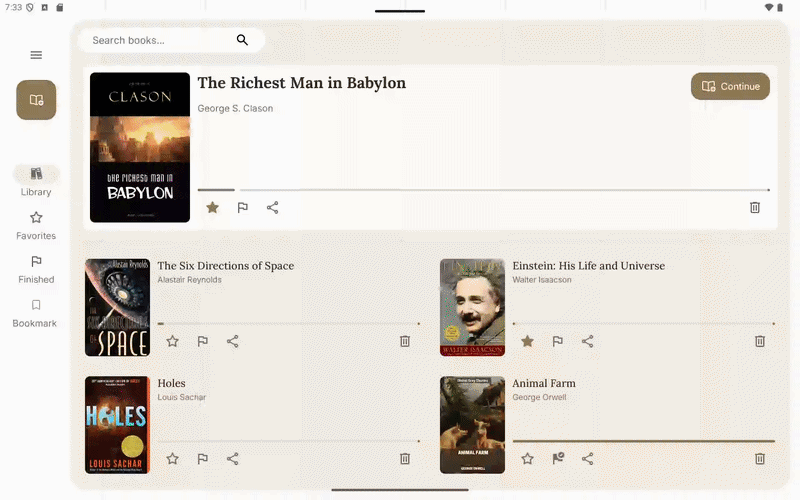
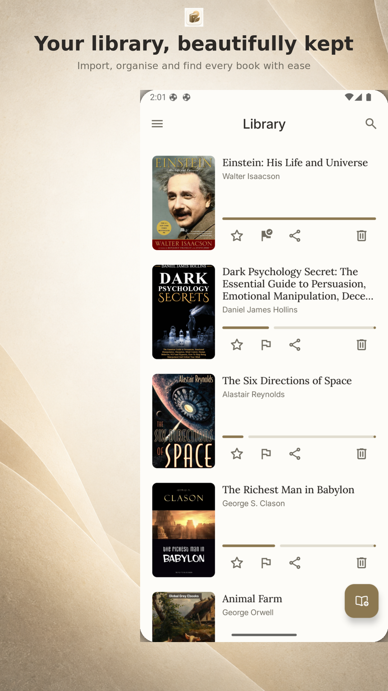
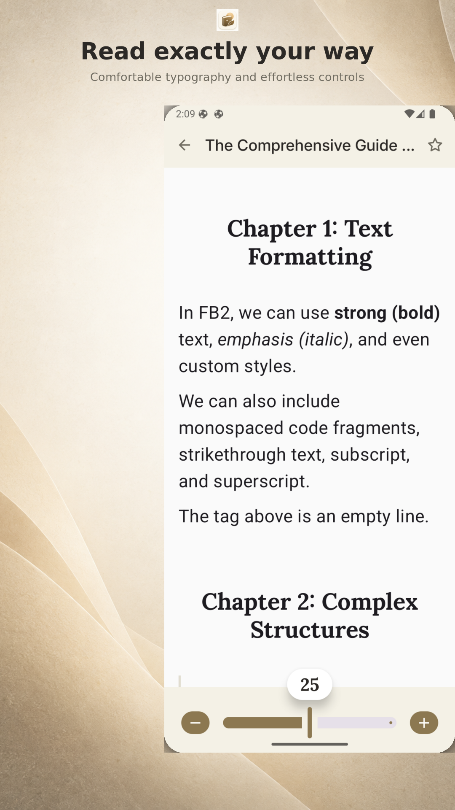
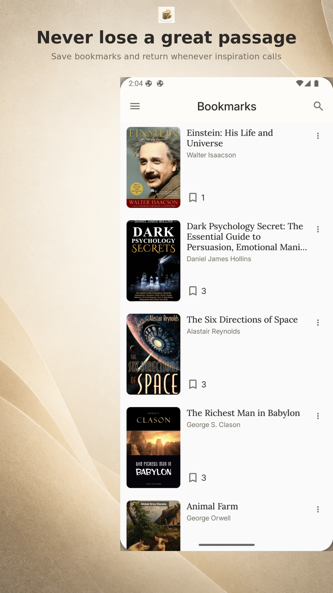

<div align="center">
  

  <h1>PageKeeper</h1>

  <p><strong>Your personal FB2 library and reader for Android.</strong></p>

  <p>
    Import, organize, read, and bookmark ebooks in a clean, adaptive interface.
  </p>

<p align="center">
  
  
  
  
  
  
</p>

  <p>
    <a href="#screenshots">Screenshots</a> &bull;
    <a href="#features">Features</a> &bull;
    <a href="#tech-stack">Tech stack</a> &bull;
    <a href="#getting-started">Getting started</a> &bull;
    <a href="#architecture">Architecture</a> &bull;
    <a href="#contributing">Contributing</a> &bull;
   <a href="#️author">Author</a> 
  </p>
</div>

---

## 📱 About PageKeeper

PageKeeper is a local-first Android ebook manager and reader focused on the **FB2 (FictionBook 2.0)** format. It extracts book metadata and cover art during import, keeps reading progress on-device, and provides a comfortable reading experience without requiring an account.

> [!NOTE]
> PageKeeper currently supports `.fb2` files only. Imported books, reading progress, bookmarks, and reader preferences are stored locally on the device.

---

<p align="center">
  <!-- Google Play badge -->
  <a href="https://play.google.com/store/apps/details?id=com.tonyxlab.smartstep" target="_blank">
    
  </a>
</p>

<p align="center">
  <!-- Demo GIF -->
  
</p>

---

## 📸 Screenshots

<p align="center">
  
  
  
</p>

## ✨ Features

- 📥 Import FB2 eBooks using Android’s system file picker
- 📚 Extract titles, authors, cover images, chapters, and formatted text
- 🛡️ Prevent duplicate imports using SHA-256 content hashing
- 🔍 Search the library and select multiple books for bulk actions
- ❤️ Mark books as favorites or finished
- 📤 Share books or remove them from the library
- 🔖 Resume reading from the last saved position and track progress
- 📑 Browse chapters and jump directly to a selected section
- 🏷️ Create, edit, color-code, open, and delete bookmarks
- 🔠 Adjust and persist the reader font size
- 📱 Enjoy adaptive navigation across different screen sizes
- 🔒 Keep library data private with local Room and DataStore persistence

## 🚀 Tech Stacks

- 🟣 Kotlin — primary programming language
- 🎨 Jetpack Compose — modern declarative UI toolkit
- 🧩 Material 3 — adaptive layouts and UI components
- 🔄 Kotlin Coroutines & Flow — asynchronous and reactive data handling
- 🧭 Navigation 3 — serializable, type-safe navigation
- 🧱 MVVM + Clean Architecture — separation of presentation, domain, and data layers
- 💾 Room Database — local storage for books, bookmarks, and reading progress
- ⚙- ️ Preferences DataStore — reader settings and user preferences
- 🧪 **Koin** — dependency injection
- 📖 XmlPullParser / KXml — FB2 eBook parsing
- 🖼️ Coil — book-cover image loading
- 🪵 Timber — debug logging


## 🏗️ Architecture

PageKeeper follows MVVM with Clean Architecture, separating the app into three main layers:

🎨 Presentation — Jetpack Compose screens, ViewModels, UI state, events, and Navigation 3
🧠 Domain — business models and repository contracts
💾 Data — Room, DataStore, repository implementations, and the FB2 importer/parser

The presentation layer uses unidirectional state handling:

📦 Immutable StateFlow values represent persistent UI state
👆 Sealed UI events represent user interactions
⚡ Channel-backed action events deliver one-off effects such as navigation and snackbar messages

## 🧰 Getting Started

### Prerequisites

- A recent stable version of [Android Studio](https://developer.android.com/studio)
- An emulator or physical device running Android 7.0 (API 24) or newer

### Set up the project

1. Clone the repository:

   ```bash
   git clone https://github.com/Tonnie-Dev/PageKeeper.git
   ```

2. Open the project in Android Studio and allow Gradle to sync.

3. Select the `app` run configuration and launch it on an emulator or connected device.

No API keys or external services are required.

## 🛂 Contributing

Contributions are welcome. To propose a change:

1. Fork the repository and create a branch from `main`.
2. Keep changes focused and follow the existing architecture and naming conventions.
3. Add or update tests where appropriate.
4. Run `./gradlew test` and `./gradlew :app:compileDebugKotlin` before opening a pull request.
5. Open a pull request describing the problem and your solution.

For larger features, consider opening an issue first so the implementation can be discussed.


## 🖋️ Author

Created by **Tonnie Dev**.

<p>
  <a href="https://github.com/Tonnie-Dev">
    
  </a>
  <a href="https://www.linkedin.com/in/antony-muchiri/">
    
  </a>
  <a href="https://twitter.com/Tonnie_Dev">
    
  </a>
</p>

## License

PageKeeper is available under the [MIT License](./readme-assets/LICENSE).
